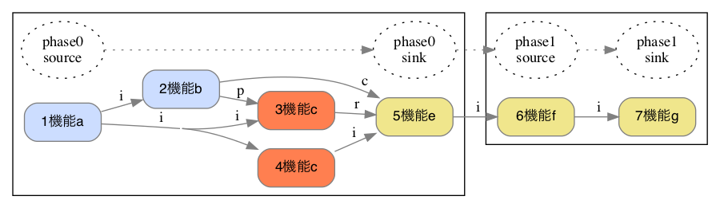
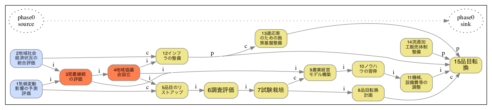

# FRAM構造図の自動作成
FRAM(機能共鳴分析)の構造図をテキストファイルから自動作成するためのスクリプト。
FRAMの構造図は機能（ノード）間の入出力（エッジ）関係が複雑であるため、直接作画すると、ファイルの更新過程で接続関係等が曖昧になる恐れがある。
テキストファイルをベースにすることで、バージョン管理と情報共有が容易になることが期待される。以下はWindowsで実行するための手順について記述する。

## 1. 環境の整備
### 1-1. pythonのインストール
Windows版Pythonのインストール方法は下記を参照。  
[https://www.python.jp/install/windows/install.html](https://www.python.jp/install/windows/install.html)  
さらに、標準で入っていないライブラリ（graphvizのラッパー）をインストールしておく必要があるので、コマンドプロンプトを立ち上げ下記を入力する。
```shell
> py -m pip install graphviz
```
### 1-2.グラフ描画ツールgraphvizのインストール
Windows版graphvizのインストール方法は下記を参照  
[http://ruby.kyoto-wu.ac.jp/info-com/Softwares/Graphviz/](http://ruby.kyoto-wu.ac.jp/info-com/Softwares/Graphviz/)

## 2. 使い方
コマンドプロンプトを立ち上げる。cdコマンドでfram_xml.pyがおいてあるフォルダへ移動して、下記のコマンドを入力。第一引数で入力ファイルを指定。
``` shell
> python fram_xml.py <input file>
```
プログラムファイルと同じフォルダにimgというサブフォルダが作成され、その中に「入力ファイル名.png」が出力される。

## 3. 入力ファイルの準備
入力ファイルはxml形式で記述する。 
### 3-1. 　function要素 
各機能とそれらの相互依存関係はfanction要素の中に記述する。function要素は以下の子要素を持つ。
- id要素: それぞれの機能に固有の識別番号
- label要素: ノードにラベルとして表示される機能の名称
- color要素: ノードの背景色、省略することも可能
- i要素: 入力（input）の対象となる情報を出力するfunction要素のid
- p要素: 前提条件（precondition）の対象となる情報を出力するfunction要素のid
- r要素: 資源（resource）の対象となる情報を出力するfunction要素のid
- c要素: 制御入力（control）の対象となる情報を出力するfunction要素のid
- t要素: 時間（time） の対象となる情報を出力するfunction要素のid
### 3-2. cluster要素とrank要素 
cluster要素で複数のfunction要素を束ねることで、大枠を設定することができる。rank要素でノード（機能)の関係を表現することができる。それぞれのフェーズの中で最初にくる機能（群）はrank要素（本文テキストはsource）でくくり、最後にくる機能（群）はrank要素（本文テキストはsink）でくくる。  
### 3-3. サンプル 
以下にサンプルコードを示す。
``` xml
<?xml version="1.0"?>
<data>
    <cluster>
        <rank>source
            <function>
                <id>1</id>
                <label>機能a</label>
            </function>
        </rank>
        <function>
            <id>2</id>
            <label>機能b</label>
            <i>1</i>
        </function>
        <function>
            <id>3</id>
            <label>機能c</label>
            <color>#ff7f50</color>
            <i>1</i>
            <p>2</p>
        </function>
        <function>
            <id>4</id>
            <label>機能c</label>
            <color>#ff7f50</color>
            <i>1</i>
        </function>
        <rank>sink
            <function>
                <id>5</id>
                <label>機能e</label>
                <color>#f0e68c</color>
                <i>4</i>
                <c>2</c>
                <r>3</r>
            </function>
        </rank> 
    </cluster>
    <cluster>
        <rank>source
            <function>
                <id>6</id>
                <label>機能f</label>
                <color>#f0e68c</color>
                <i>5</i>
            </function>
        </rank> 
        <rank>sink
            <function>
                <id>7</id>
                <label>機能g</label>
                <color>#f0e68c</color>
                <i>6</i>
            </function>
        </rank> 
    </cluster>
</data>
```


## 4. 出力ファイル
プロセスは左から右へと進展するように描かれる。オリジナルのframでは機能を六角形のノードで表現し、それぞれの頂点に入出力の詳細情報の意味づけがされていたが、図が複雑になるため、機能間を結ぶエッジにラベルを付ける。下記はサンプルコードの出力。
 

### 水災害分野

### 農業分野

